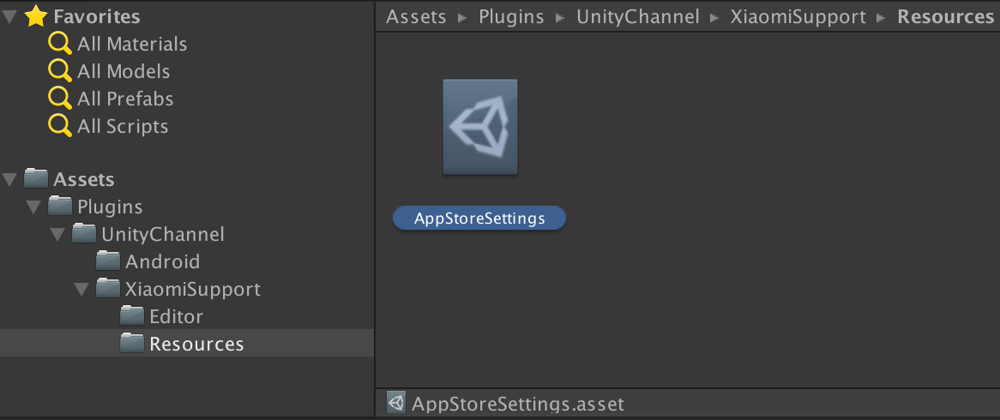
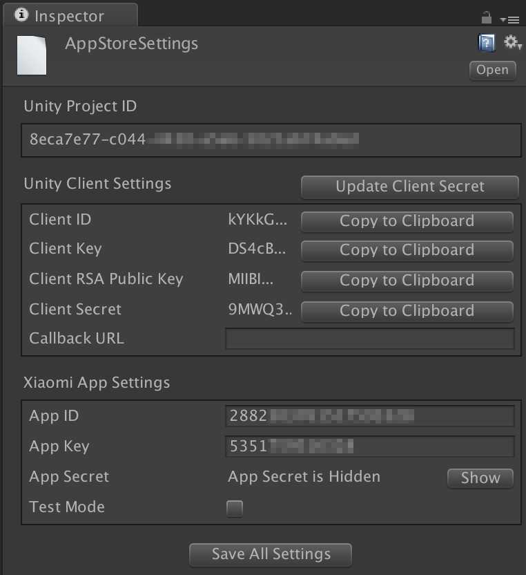

# Overview
## What is Stand-alone Xiaomi SDK

Unity SDK for Xiaomi integrates Xiaomi store to Unity IAP, which includes Amazon, Google Play, etc. The stand-alone Xiaomi SDK isn't integrated to Unity IAP and just include Xiaomi Store SDK.

If developers only need to publish their games to Xiaomi Store, this SDK will suffice.

For more information, please refer to https://unity3d.com/cn/partners/xiaomi/guide

## Process of Using Stand-alone Xiaomi SDK
- Technical Integration
	- [Onboarding to Unity](#onboarding-to-unity), which requires Xiaomi app info (appId, appKey, etc.).
	- [Prepare debug file for Xiaomi](#prepare-debug-file-for-xiaomi).
	- [Server side integration](#server-side-integration).
	- [Client side integration](#client-side-integration).
- Build and submit the APKs.

## Technical Integration
### <a name="onboarding-to-unity" />Onboarding to Unity
Before integration can start, Game developer first needs to onboard to Unity IAP and will obtain the following developer credentials (these keys are binding to the project and bundle id):
- Unity Client Id
- Unity Client Key
- Unity Client Secret
- Unity Client RSA Public Key

Meanwhile, Game needs to provide the appId, appKey and appSecret offered by Xiaomi, and a callback URL of the Game server (if there exists one) to receive order status update.
Before going live, Game developer will also need to whitelist Unity IAP’s production server.
If Game developer works with Unity 5.6.1 or newer version, he can do the onboarding himself with the latest Unity IAP SDK for Xiaomi by following steps:
(Note: The organization owner is allowed to generate/update Unity Client and user/manager can only read exited Unity Client information. Setting the Test Mode is allowed for everyone.)
1. Import stand-alone Xiaomi SDK (https://unitytech.github.io/channel)
2. Open the onbording Inspector: click the AppStoreSettings.asset at UnityChannel/XiaomiSupport/Resources.

If the current Unity Project has owned one project ID (if not, please create one project ID first), the Inspector will show the information for onboarding.


3. To generate one Unity Client, Game developer can click `Generate Unity Client` and get the related Unity Client information. For this step, the callback url and the Xiaomi app information (appId, appKey, appSecret) is not necessary. The callback url and Xiaomi app information can be provided by later updating by clicking `Save All Settings`. Meanwhile, when switching Test(Debug) Mode for application, `Save All Settings` is also needed to be clicked to save the choice.

If the current Unity Project has already onboarded, the existed Unity Client will be loaded at this step.

Game developer can use `Copy to Clipboard` to copy Unity Client Id, Unity Client Key, Unity Client Secret, Unity Client RSA Public Key to clipboard if he wants to store this information by himself. And he can click `Update Client Secret` to change Unity Client Secret to a new one.

Note: 
1. Unity Client Secret (as well as callback url and Xiaomi appSecret) is not used in the application, hence it will not be stored in the asset and built into application, It is only handled in memory.
2. Most operation for onboarding (generating/loading/updating Unity Client) will send networked request to Unity backend server. You can check the log information shown in Console to have an idea of the progress of the operation.

### <a name="prepare-debug-file-for-xiaomi" />Prepare debug file for Xiaomi
If you want to debug your purchase app, you must have a `MiProductCatalog.prop` file to tell Xiaomi SDK what products can be used under mode.
[Here](MiProductCatalog.unitypackage) is an example `MiProductCatalog.prop` file. The prices must be in line with [Xiaomi price tiers](#xiaomi-price-tiers).

### <a name="server-side-integration" />Server Side Integration
Please see the doc of Unity SDK for Xiaomi.

### <a name="client-side-integration" />Client Side Integration
#### Initialization
Please make sure initialization is called in `Awake()` or `Start()`.
First, you need to implement `ILoginListener`:
```csharp
private class MyLoginListener : ILoginListener
{
	public void OnLogin(UserInfo userInfo)
    {
        Debug.Log(string.Format("Login Succeed: userId {0}, userLoginToken {1}, channel {2}",
            userInfo.userId, userInfo.userLoginToken, userInfo.channel));
    }

    public void OnInitialized()
    {
        Debug.Log("Initialize Succeed");
    }

    public void OnInitializeFailed(string message)
    {
        Debug.Log("Initialize Failed " + message);
    }

    public void OnLoginFailed(string message)
    {
        Debug.Log("Login Failed: " + message);
    }
}
```

Then, if you are using `App Store Settings`(Unity 5.6.1+), you can initialize like this:
```csharp
using UnityEngine.Store;
......

void Awake()
{
    var myLoginListener = new MyLoginListener();
    AppStoreSettings appStoreSettings = Resources.Load<AppStoreSettings>("AppStoreSettings");
    StoreService.Initialize(appStoreSettings.getAppInfo(), myLoginListener);
}
```
Otherwise, you can initialize like this:
```csharp
using UnityEngine.Store;
......

void Awake()
{
    var myLoginListener = new MyLoginListener();
    var appInfo = new AppInfo();

    appInfo.appId = "YOUR APP ID";
    appInfo.appKey = "YOUR APP KEY";
    appInfo.clientId = "YOUR CLIENT ID";
    appInfo.clientKey = "YOUR CLIENT KEY";
    appInfo.debug = false; // debug mode or not
    StoreService.Initialize(appInfo, myLoginListener);
}
```
> These info can be obtained when developers have [onboarded the app](#onboarding-to-unity)

#### Login
Login is just a simple statment:
```csharp
using UnityEngine.Store;
......

StoreService.Login(myLoginListener);
```

> Sometimes users can not login using Xiaomi SDK, that maybe because there is no product configured for IAP on Xiaomi portal.

#### Purchase
First, `IPurchaseListener` needs to be implemented.
```csharp
using UnityEngine.ChannelPurchase;
......

private class MyPurchaseListener : IPurchaseListener
{
    public void OnPurchase(PurchaseInfo purchaseInfo)
    {
        Debug.Log("Purchase Succeed: " + purchaseInfo.gameOrderId);
    }

    public void OnPurchaseFailed(string message, PurchaseInfo purchaseInfo)
    {
        Debug.Log("Purchase Failed: " + message);
    }

    public void OnPurchaseRepeated(string productCode)
    {
        Debug.Log("Purchase Repeated");
    }

    public void OnReceiptValidate(ReceiptInfo receiptInfo)
    {
        Debug.Log("Validate Succeed");
    }

    public void OnReceiptValidateFailed(string gameOrderId, string message)
    {
        Debug.Log("Validate Failed");
    }

    public void OnPurchaseConfirm(string gameOrderId)
    {
        Debug.Log("Confirm Succeed");
    }

    public void OnPurchaseConfirmFailed(string gameOrderId, string message)
    {
        Debug.Log("Confirm Failed");
    }
}
```
Then call `Purchase` method.

```csharp
using UnityEngine.ChannelPurchase;
......

PurchaseService.Purchase("Product ID", "Game Order ID", myPurchaseListener);
```

> - `Product ID` is configured on Xiaomi Dev Portal. If the app is run in debug mode, the `Prodcut ID` should exist in `MiProductCatalog.prop` file.
> - `Game Order ID` can be null and our SDK will generate and UUID for it.

#### Purchase Validation
After one purchase is finished, developers can validate the purchase by calling the `ValidateReceipt` API:
```csharp
using UnityEngine.ChannelPurchase;
......

PurchaseService.ValidateReceipt(gameOrderId, myPurchaseListener);
```
if `gameOrderId` is valid, developers can get a `ReceiptInfo` in the `myPurchaseListener`. `ReceiptInfo` contains `signData` and `signature` which can be used to validate the purchase. If the game has a server, this is usually validated on the server, please refer to the [server sample code](https://unitytech.github.io/channel/server-sample-code/). Developers can also validate the `signData` on the client side. The procedure can be very similar to the server side validation.

# Appendices
## <a name="xiaomi-price-tiers" />Xiaomi Price Tiers
Note that in `MiProductCatalog.prop`, the unit of price is 1/100 of Chinese Yuan.

| Tier        | Price in RMB           | Tier | Price in RMB | Tier | Price in RMB | 
| :------------- |-------------:| :-----| -----:| :-----| -----:|
|Tier 1| ￥1.00|Tier 2|￥3.00|Tier 3|￥6.00|
|Tier 4| ￥8.00|Tier 5|￥12.00|Tier 6|￥18.00|
|Tier 7| ￥25.00|Tier 8|￥28.00|Tier 9|￥30.00|
|Tier 10| ￥40.00|Tier 11|￥45.00|Tier 12|￥50.00|
|Tier 13| ￥60.00|Tier 14|￥68.00|Tier 15|￥73.00|
|Tier 16| ￥78.00|Tier 17|￥88.00|Tier 18|￥93.00|
|Tier 19| ￥98.00|Tier 20|￥108.00|Tier 21|￥113.00|
|Tier 22| ￥118.00|Tier 23|￥123.00|Tier 24|￥128.00|
|Tier 25| ￥138.00|Tier 26|￥148.00|Tier 27|￥153.00|
|Tier 28| ￥158.00|Tier 29|￥163.00|Tier 30|￥168.00|
|Tier 31| ￥178.00|Tier 32|￥188.00|Tier 33|￥193.00|
|Tier 34| ￥198.00|Tier 35|￥208.00|Tier 36|￥218.00|
|Tier 37| ￥223.00|Tier 38|￥228.00|Tier 39|￥233.00|
|Tier 40| ￥238.00|Tier 41|￥243.00|Tier 42|￥248.00|
|Tier 43| ￥253.00|Tier 44|￥258.00|Tier 45|￥263.00|
|Tier 46| ￥268.00|Tier 47|￥273.00|Tier 48|￥278.00|
|Tier 49| ￥283.00|Tier 50|￥288.00|Tier 51|￥298.00|
|Tier 52| ￥308.00|Tier 53|￥318.00|Tier 54|￥328.00|
|Tier 55| ￥348.00|Tier 56|￥388.00|Tier 57|￥418.00|
|Tier 58| ￥448.00|Tier 59|￥488.00|Tier 60|￥518.00|
|Tier 61| ￥548.00|Tier 62|￥588.00|Tier 63|￥618.00|
|Tier 64| ￥648.00|Tier 65|￥698.00|Tier 66|￥798.00|
|Tier 67| ￥818.00|Tier 68|￥848.00|Tier 69|￥898.00|
|Tier 70| ￥998.00|Tier 71|￥1048.00|Tier 72|￥1098.00|
|Tier 73| ￥1148.00|Tier 74|￥1198.00|Tier 75|￥1248.00|
|Tier 76| ￥1298.00|Tier 77|￥1398.00|Tier 78|￥1448.00|
|Tier 79| ￥1498.00|Tier 80|￥1598.00|Tier 81|￥1648.00|
|Tier 82| ￥1998.00|Tier 83|￥2298.00|Tier 84|￥2598.00|
|Tier 85| ￥2998.00|Tier 86|￥3298.00|Tier 87|￥3998.00|
|Tier 88| ￥4498.00|Tier 89|￥4998.00|Tier 90|￥5898.00|

## API References
### Namespace `UnityEngine.Store`

#### Class `AppInfo`
Variables:

|Key| Type| Description|
| :------ | :------ | :------ |
|appId| string| Xiaomi app id| 
|appKey| string| Xiaomi app key| 
|clientId| string| Unity client id| 
|clientKey| string| Unity client key| 
|debug | bool | Determine whether the app is run under debug mode| 

#### Interface `ILoginListener`
Functions:

|Key| Return Type| Description|
| :------ | :------ | :------ |
|OnInitialized()| void | Called when initialization succeeds | 
|OnInitializedFailed(string message) | void | Called when initialization fails| 
|OnLogin()| void | Called when login succeeds| 
|OnLoginFailed(string message)| void | Called when login fails| 

#### class `StoreService`
Functions:

|Key| Return Type| Description|
| :------ | :------ | :------ |
|static Initialize(AppInfo appInfo, ILoginListener listener)| void | Initialize the SDK| 
|static Login(ILoginListener listener)| void | Login to the Xiaomi account| 

#### class `UserInfo`
Variables:

|Key| Type| Description|
| :------ | :------ | :------ |
|channel| string| Indicate which channel the developer are using, for now, it will only be `XIAOMI`| 
|userId| string| Channel's unique user id| 
|userLoginToken| string| Can be used to validate the user login. See [server side integration](#server-side-integration) for detail| 

### Namespace `UnityEngine.ChannelPurchase`
#### Class `PurchaseInfo`
Variables:

|Key| Type| Description|
| :------ | :------ | :------ |
|productCode| string| The product id. For Xiaomi, developers can configure the product id on Xiaomi Dev Portal| 
|gameOrderId| string| The order id of the purchase| 
|orderQueryToken| string| Can be used to validate the purchase. See [server side integration](#server-side-integration) for detail| 

#### Class `ReceiptInfo`
Variables:

|Key| Type| Description|
| :------ | :------ | :------ |
|gameOrderId| string| The order id of the purchase| 
|signData| string| A JSON string which contains details of the purchase | 
|signature| string| The signature of signData. | 

#### Interface `IPurchaseListener`
Functions:

|Key| Return Type| Description|
| :------ | :------ | :------ |
|OnPurchase| void | Called when the purchase succeeds | 
|OnPurchaseFailed(string message, PurchaseInfo purchaseInfo)| void | Called when the purchase fails| 
|OnPurchaseRepeated(string productCode)|void | Called when non-consumable products are purchased the second time|
|OnReceiptValidate(ReceiptInfo receiptInfo)|void | Called when `PurchaseService.ValidateReceipt(...)` succeeds|
|OnReceiptValidateFailed(string gameOrderId, string message)| void | Called when `PurchaseService.ValidateReceipt(...)` fails|
|OnPurchaseConfirm(string gameOrderId)| void | *deprecated*|
|OnPurchaseConfirmFailed(string gameOrderId, string message)| void | *deprecated* |

#### Class `PurchaseService`
Functions:

|Key| Return Type| Description|
| :------ | :------ | :------ |
| static Purchase(string productCode, string gameOrderId, IPurchaseListener listener) |  void | Purchase products |
|static ValidateReceipt(string gameOrderId, IPurchaseListener listener)| void | Validate purchase |
| static ConfirmPurchase | void | *deprecated* Please use `ValidateReceipt` instead|